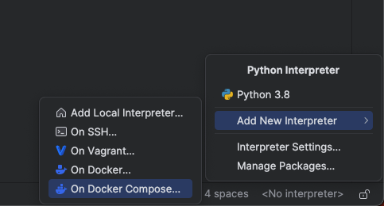
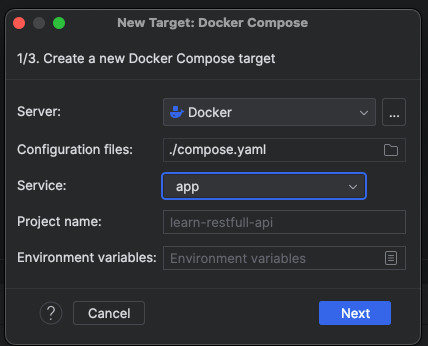
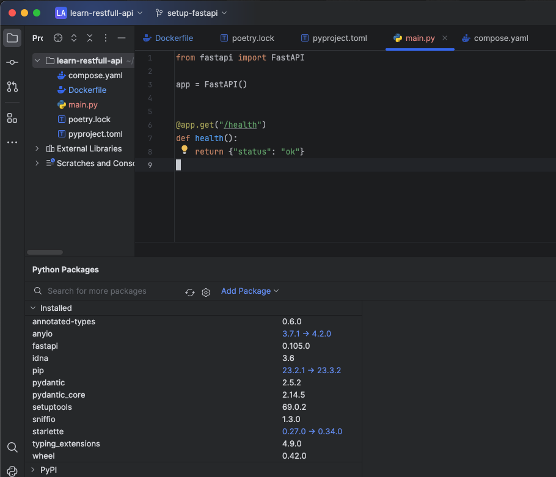

Setup pycharm python interpreter
===

## これはなに

PyCharm で docker compose と連携させて、コード補完やコードジャンプが動作するように設定する手順を記載しています。

## 手順

右下の <No interpreter> をクリックし、On Docker Compose ... をクリックする

Dockerの設定を行う

画面のような結果になったのを確認してNextをクリック

System Interpreter を選択

赤い波線が消えて、コードの保管やコードジャンプができることを確認する。

